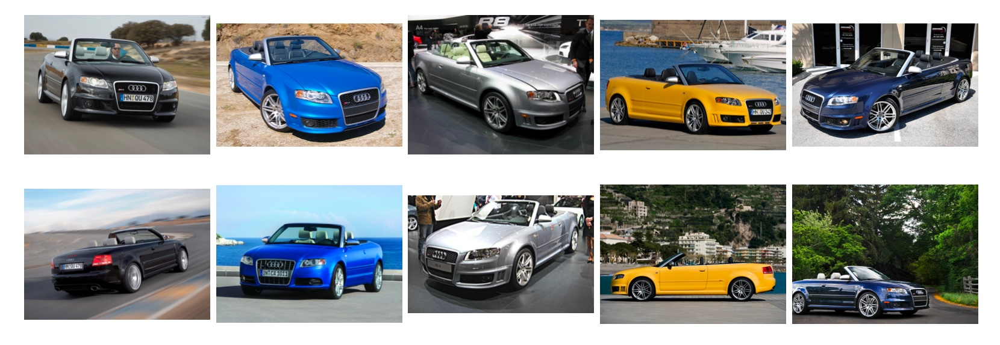

# Refined Stanford Cars Dataset

**Figure 1:** *Example images from the Stanford Cars [1] dataset. Showing cars from the same model which previously 
belong to the same class. After the refinement, each column correspond to an individual class.*

This repository contains a refined annotation file for the Stanford Cars [1] dataset, characterized by an increased 
class granularity. In its original form, the dataset contained 196 classes, with each class denoting a different car model. 
After the refinement process, the dataset now contains 1,288 classes, with each class representing a unique combination 
of car model and color, as shown in Figure 1.

The refinement process involved leveraging the color information inherent in the images. Accordingly, various car color 
classification models were subjected to fine-tuning (FT) or linear probing (LP) and evaluation on the Vehicle Color Recognition 
(VCoR) dataset [2]. These models were then used to predict the colors of cars in the Stanford Cars [1] dataset. 
The predicted color information was then used to increase the class granularity of the Stanford Cars dataset.

The repository also contains the code used for training the color classification models (see [IV. Training](#iv-training)), 
as well as the code used for the refinement process (see [V. Refinement](#v-refinement)). The refined annotation file 
of the Stanford Cars dataset is provided in the `data` directory and was refined using the `CLIP ConvNeXt-B` model 
trained (LP + FT) on the VCoR dataset [2] for 10 epochs.

## I. Setup

Here, we describe a step-by-step guide to setup and install dependencies on a UNIX-based system, such as Ubuntu, using 
`conda` as package manager. If `conda` is not available, alternative package managers such as `venv` can be used.

#### 1. Create a virtual environment
```
conda create -n env_sc_refine python=3.8
conda activate env_sc_refine
```
#### 2. Clone the repository
```
git clone git@github.com:morrisfl/stanford_cars_refined.git
```
#### 3. Install pytorch
Depending on your system and compute requirements, you may need to change the command below. See [pytorch.org](https://pytorch.org/get-started/locally/) 
for more details.
```
conda install pytorch torchvision pytorch-cuda=11.8 -c pytorch -c nvidia
```
#### 4. Install the repository with all dependencies
```
cd stanford_cars_refined
python -m pip install .
```
If you want to make changes to the code, you can install the repository in editable mode:
```
python -m pip install -e .
```

## III. Data Preparation

### VCoR Dataset
During the training process, the VCoR [2] dataset was used. The dataset consists of approximately 10,500 images distributed 
over 15 different car color classes and is divided into training (7.5k images), validation (1.5k images), and test (1.5k images) 
sets. Notably, only 10 of the 15 classes were used for training, and classes such as *beige*, *gold*, *pink*, *purple*, 
and *tan* were excluded from the process. The rationale for excluding these classes was based on the understanding that 
these colors do not predominantly represent colors associated with cars in the Stanford Cars [1] dataset.
The VCoR dataset can be downloaded from [here](https://www.kaggle.com/datasets/landrykezebou/vcor-vehicle-color-recognition-dataset)
and should be placed in a `<data_dir>` directory. The directory structure should look like this:
```
<data_dir>
└───vcor-vehicle-color-recognition-dataset
    ├───test
    ├───train
    └───val
```

### Stanford Cars Dataset
The training set of the Stanford Cars [1] dataset was used for the refinement process. The training set consists of
8,144 images distributed over 196 different car model classes. The dataset can be downloaded from [here](https://www.kaggle.com/datasets/jessicali9530/stanford-cars-dataset)
and the corresponding annotation file in csv utilized for the refinement process can be downloaded from [here](https://github.com/BotechEngineering/StanfordCarsDatasetCSV/tree/main).
The images and annotation file should be placed in a `<data_dir>` directory. The directory structure should look like this:
```
<data_dir>
└───stanford-cars-dataset
    ├───cars_train/cars_train
    └───train.csv
```

## IV. Training
We trained (LP, FT, and LP-FT) different color classification models on the VCoR [2] dataset. The training settings and 
results are shown below.

### Linear Probing (LP)
Run the following command to linear probe a model on the VCoR [2] dataset:
```
python src/train.py siglip <data_dir> \
    --output_dir results/ \
    --batch_size 64 \
    --train_style lp \
    --epochs 10 \
    --optimizer adamw \
    --lr 1e-3 \
    --weight_decay 1e-4 \
    --scheduler cosine \
    --min_lr 1e-4 \
    --warmup_steps 82 \
    --warmup_factor 0.1 \
```

| Model           | Pre-training dataset | Validation Accuracy | Test Accuracy |
|-----------------|----------------------|:-------------------:|:-------------:|
| SigLIP ViT-B/16 | WebLI                |       0.9281        |    0.9105     |
| DINOv2 ViT-B/16 | LVD-142M             |       0.7511        |    0.7350     |
| CLIP ConvNeXt-B | LAION-2B             |       0.9218        |    0.9237     |
| ConvNeXt-B      | ImageNet-1k          |       0.8419        |    0.8308     |
| EfficientNet-B1 | ImageNet-1k          |       0.7170        |    0.6580     |

**Table 1:** *Linear probing results on the VCoR [2] dataset.*

### Fine-tuning (FT)
Run the following command to fine-tune a model on the VCoR [2] dataset:
```
python src/train.py siglip <data_dir> \
    --output_dir results/ \
    --batch_size 64 \
    --train_style ft \
    --epochs 10 \
    --optimizer adamw \
    --lr lr \
    --weight_decay 1e-4 \
    --scheduler cosine \
    --min_lr min_lr \
    --warmup_steps 82 \
    --warmup_factor 0.1 \
```

| Model           | Pre-training dataset | `lr` | `min_lr` | Validation Accuracy | Test Accuracy |
|-----------------|----------------------|:----:|:--------:|:-------------------:|:-------------:|
| SigLIP ViT-B/16 | WebLI                | 1e-5 |   1e-6   |       0.9434        |    0.9400     |
| DINOv2 ViT-B/16 | LVD-142M             | 1e-5 |   1e-6   |       0.9389        |    0.9194     |
| CLIP ConvNeXt-B | LAION-2B             | 1e-5 |   1e-6   |       0.9416        |    0.9382     |
| ConvNeXt-B      | ImageNet-1k          | 1e-4 |   1e-5   |       0.9470        |    0.9329     |
| EfficientNet-B1 | ImageNet-1k          | 1e-3 |   1e-4   |       0.9263        |    0.8926     |

**Table 2:** *Fine-tuning results on the VCoR [2] dataset.*

### Linear Probing + Fine-tuning (LP-FT)
Run the following command to linear probe and fine-tune a model on the VCoR [2] dataset:
```
python src/train.py siglip <data_dir> \
    --output_dir results/ \
    --batch_size 64 \
    --train_style lp-ft \
    --lp_epochs 5 \
    --epochs 10 \
    --optimizer adamw \
    --lr 1e-3 \
    --ft_lr_factor 1e-2 \
    --weight_decay 1e-4 \
    --scheduler cosine \
    --min_lr 1e-4 \
    --warmup_steps 82 \
    --warmup_factor 0.1 \
```

| Model           | Pre-training dataset | Validation Accuracy | Test Accuracy |
|-----------------|----------------------|:-------------------:|:-------------:|
| SigLIP ViT-B/16 | WebLI                |       0.9452        |    0.9391     |
| CLIP ConvNeXt-B | LAION-2B             |       0.9443        |    0.9454     |
| ConvNeXt-B      | ImageNet-1k          |       0.9326        |    0.9257     |

**Table 3:** *Linear probing + fine-tuning results on the VCoR [2] dataset.*

## V. Refinement
After training the car color classification models on the VCoR [2] dataset, these models can be used to enhance the class
granularity of the Stanford Cars [1] dataset. The refinement process can be performed by running the following command:
```
python src/inference.py <data_dir>/stanford-cars-dataset results/<model_name.pt> data/

```


## References
[1] Jonathan Krause et al. “3D Object Representations for Fine-Grained Categorization”. In: Proceedings of the IEEE 
International Conference on Computer Vision Workshops. 2013, pp. 554–561. URL: https://www.cv-foundation.org/openaccess/content_iccv_workshops_2013/W19/html/Krause_3D_Object_Representations_2013_ICCV_paper.html 

[2] Karen Panetta et al. “Artificial Intelligence for Text-Based Vehicle Search, Recognition, and Continuous Localization 
in Traffic Videos”. In: AI 2.4 (Dec.2021). Number: 4 Publisher: Multidisciplinary Digital Publishing Institute,
pp. 684–704. ISSN: 2673-2688. DOI: 10.3390/ai2040041. URL: https://www.mdpi.com/2673-2688/2/4/41
